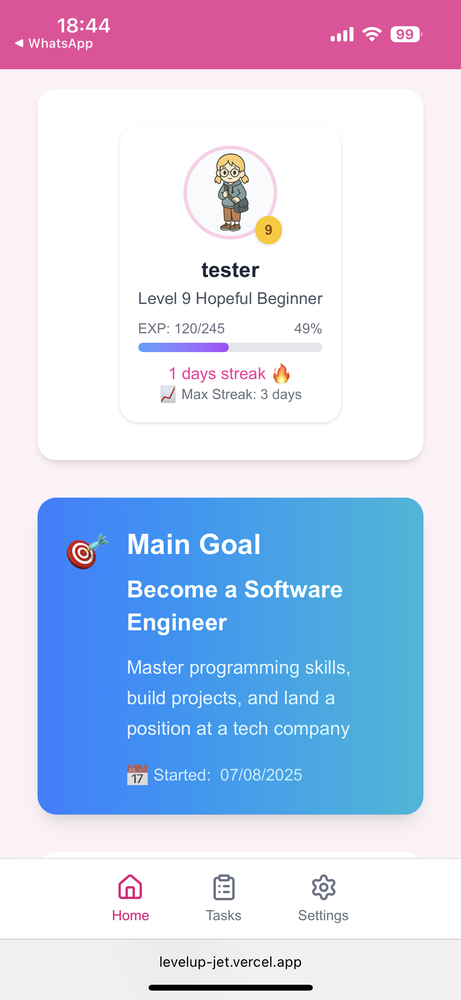
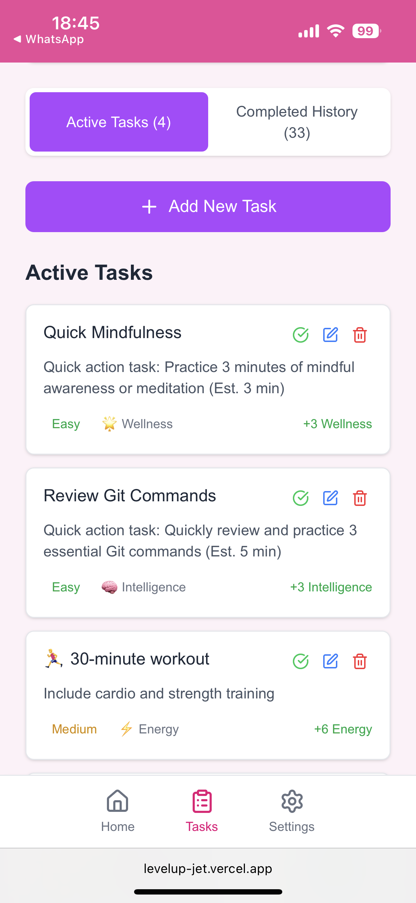
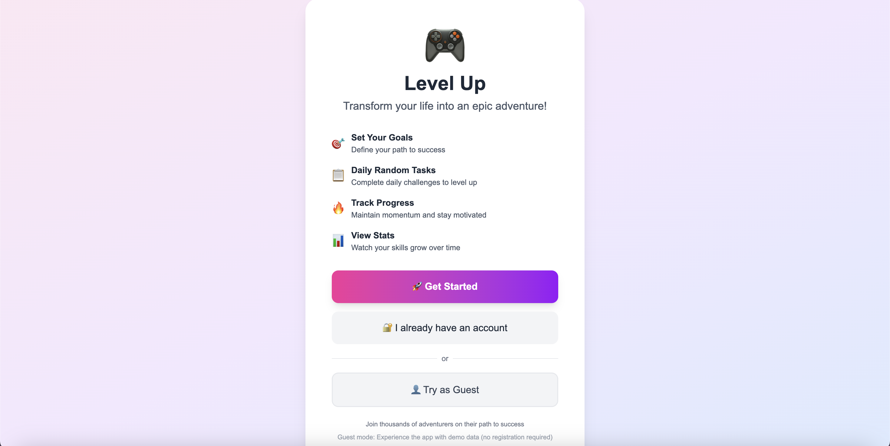

# 🎯 LevelUp - Gamified Productivity App

> Transform your daily tasks into an RPG-style adventure with character progression, skill building, and reward systems.

## 🌐 Live Demo

**Try the app now:** [https://levelup-jet.vercel.app/home](https://levelup-jet.vercel.app/home)

✨ **New Feature**: Click "👤 Try as Guest" to explore all features with demo data - no registration required!

[](https://opensource.org/licenses/MIT)
[](https://www.djangoproject.com/)
[](https://reactjs.org/)
[](https://www.python.org/)

## 📋 Table of Contents

- [Live Demo](#-live-demo)
- [Screenshots](#-screenshots)
- [Overview](#-overview)
- [Features](#-features)
- [Tech Stack](#-tech-stack)
- [Installation](#-installation)
- [Usage](#-usage)
- [API Documentation](#-api-documentation)
- [Project Structure](#-project-structure)
- [Contributing](#-contributing)
- [License](#-license)

## 📸 Screenshots

### Mobile Experience



_Mobile homepage with character progression and daily tasks_



_Mobile task management with attribute-based categorization_

### Web Experience


_Web welcome page and onboarding experience_


_Comprehensive progress tracking and statistical analysis_

## 🎮 Overview

LevelUp is a gamified productivity application that transforms mundane daily tasks into an engaging RPG-style experience. Users can level up their character, gain experience points, and develop six core attributes through completing real-world tasks.

### Core Concept

- **Character Development**: Build your virtual character by completing real tasks
- **Attribute System**: Develop Intelligence, Discipline, Energy, Social skills, Wellness, and manage Stress
- **Dynamic Task Generation**: Daily tasks generated based on your personal goals
- **Time-Limited Challenges**: Quick micro-tasks for instant motivation boosts
- **Progress Tracking**: Visual progression with streaks, level-ups, and achievements

## ✨ Features

### 👥 Guest Mode Experience

- **Try Without Registration**: Experience the full app with demo data
- **No Commitment Required**: Test all features before creating an account
- **Persistent Demo Session**: Your demo progress is saved across browser sessions
- **Easy Conversion**: Seamlessly convert to a real account when ready

### 💼 Task Management

- **Daily Random Tasks**: 10 personalized tasks generated based on your main goal
- **Task Completion & Undo**: Complete tasks with a tap, undo if needed
- **Time-Limited Quests**: Quick challenges that appear randomly for immediate motivation boosts
- **Task Categorization**: Tasks organized by attribute focus (Intelligence, Discipline, etc.)
- **Progress Tracking**: Visual completion rates and streak tracking
- **Cross-Page Persistence**: Task states maintained when navigating between pages

### 📈 Character Progression

- **Six Core Attributes**:
  - 🧠 **Intelligence**: Coding, learning, problem-solving
  - 💪 **Discipline**: Habits, consistency, self-control
  - ⚡ **Energy**: Exercise, movement, vitality
  - 🤝 **Social**: Communication, networking, relationships
  - 🌿 **Wellness**: Mental health, mindfulness, balance
  - 😰 **Stress**: Managed separately (lower is better)
- **Level System**: Character levels up based on experience points
- **Experience Points**: Earned through task completion
- **Visual Avatar**: Character appearance evolves with progression

### 🎨 User Experience

- **Guest Mode**: Try the full experience with demo data before registering
- **Mobile-First Design**: Responsive interface optimized for all devices
- **Real-Time Updates**: Instant feedback on task completion
- **Level-Up Celebrations**: Satisfying visual notifications for achievements
- **Weekly Statistics**: Comprehensive progress tracking and analytics
- **Streak System**: Motivation through consecutive day tracking
- **Persistent State**: Progress saved across browser sessions (both demo and real accounts)

### 🔧 System Features

- **Goal Setting**: Set and track personal development objectives
- **Task History**: Complete log of all completed activities
- **Data Persistence**: Reliable data storage with SQLite database
- **RESTful API**: Clean separation between frontend and backend
- **Error Handling**: Robust error management and user feedback

## 🛠 Tech Stack

### Frontend

- **React 19.1.0** - Modern UI framework with hooks
- **Vite 7.0** - Fast build tool and development server
- **Tailwind CSS 4.1** - Utility-first CSS framework
- **React Router 7.7** - Client-side routing
- **Lucide React** - Beautiful icon library
- **JavaScript ES6+** - Modern JavaScript features

### Backend

- **Django 5.2.5** - Python web framework
- **Django REST Framework** - API development
- **SQLite** - Lightweight database for development
- **Python 3.13** - Latest Python features and performance

### Development Tools

- **ESLint** - Code linting and formatting
- **PostCSS** - CSS processing
- **Git** - Version control
- **VS Code** - Recommended IDE

## 🚀 Installation

### Prerequisites

- **Python 3.13+**
- **Node.js 18+**
- **npm** or **yarn**
- **Git**

### Backend Setup

1. **Clone the repository**

   ```bash
   git clone https://github.com/elena1211/gamified_app.git
   cd LevelUp_Project
   ```

2. **Create virtual environment**

   ```bash
   python -m venv .venv
   source .venv/bin/activate  # On Windows: .venv\Scripts\activate
   ```

3. **Install Python dependencies**

   ```bash
   pip install -r requirements.txt
   ```

4. **Database setup**

   ```bash
   python manage.py makemigrations
   python manage.py migrate
   ```

5. **Create superuser (optional)**

   ```bash
   python manage.py createsuperuser
   ```

6. **Start Django development server**
   ```bash
   python manage.py runserver
   ```

### Frontend Setup

1. **Navigate to frontend directory**

   ```bash
   cd frontend
   ```

2. **Install dependencies**

   ```bash
   npm install
   ```

3. **Configure environment variables (optional)**

   ```bash
   # Copy the example file and modify if needed
   cp .env.example .env.development
   # The default settings should work for local development
   ```

4. **Start development server**

   ```bash
   npm run dev
   ```

5. **Open application**
   ```
   Frontend: http://localhost:5173
   Backend API: http://localhost:8000
   Django Admin: http://localhost:8000/admin
   ```

## 🎯 Usage

### Getting Started

**Option 1: Try as Guest**

1. **Visit Welcome Page**: Click "👤 Try as Guest" button
2. **Explore Demo Mode**: Experience all features with sample data
3. **Complete Demo Tasks**: Test task completion and character progression
4. **Convert When Ready**: Register to save your real progress

**Option 2: Create Account**

1. **Register**: Create account with username and password
2. **Set Main Goal**: Choose your primary focus area (e.g., "Software Engineer")
3. **Complete Daily Tasks**: Start with the generated daily random tasks
4. **Track Progress**: Watch your character grow and attributes develop
5. **Level Up**: Celebrate achievements and unlock new features

### Daily Workflow

**For New Users (Guest Mode):**

1. **Start with Demo**: Try guest mode to understand the system
2. **Explore Features**: Complete demo tasks, check statistics
3. **Experience Progression**: See how character attributes grow
4. **Convert Account**: Register when you're ready to track real progress

**For Registered Users:**

1. **Morning**: Check your 10 daily random tasks
2. **Throughout Day**: Complete time-limited quests for quick wins
3. **Task Completion**: Tap tasks to mark complete and gain experience
4. **Undo if Needed**: Tap completed tasks again to undo completion
5. **Progress Review**: Check weekly stats and maintain streaks
6. **Evening**: Reflect on daily achievements

### Tips for Success

- **Try Guest Mode First**: Get familiar with the system before committing
- **Start Small**: Focus on completing easier tasks first
- **Maintain Streaks**: Consistency is key for character development
- **Balance Attributes**: Work on all six areas for well-rounded growth
- **Use Time-Limited Tasks**: Perfect for motivation during low-energy moments
- **Track Weekly Progress**: Use statistics to identify improvement areas
- **Undo Mistakes**: Accidentally completed a task? Just tap it again to undo

## 📚 API Documentation

### Base URL

```
http://localhost:8000/api
```

### Authentication Endpoints

- `POST /api/register/` - User registration
- `POST /api/login/` - User login

### Task Endpoints

- `GET /api/tasks/` - Get user tasks
- `POST /api/tasks/complete/` - Complete a task
- `POST /api/tasks/complete-dynamic/` - Complete dynamic task
- `POST /api/tasks/uncomplete-dynamic/` - Uncomplete dynamic task
- `GET /api/tasks/completed-history/` - Get completion history
- `GET /api/tasks/weekly-stats/` - Get weekly statistics

### User Endpoints

- `GET /api/user/stats/` - Get user statistics
- `GET /api/user/progress/` - Get user progress data

### Goal Endpoints

- `GET /api/goal/` - Get user goals
- `POST /api/goal/` - Create/update goals

## 📁 Project Structure

```
LevelUp_Project/
├── backend/                 # Django backend
│   ├── __init__.py
│   ├── admin.py            # Admin interface configuration
│   ├── apps.py             # App configuration
│   ├── models.py           # Database models
│   ├── settings.py         # Django settings
│   ├── urls.py             # URL routing
│   ├── views.py            # API endpoints
│   └── migrations/         # Database migrations
├── frontend/               # React frontend
│   ├── public/            # Static assets
│   │   └── avatars/       # Character avatar images
│   ├── src/
│   │   ├── components/    # Reusable UI components
│   │   ├── pages/         # Page components
│   │   ├── context/       # React context for state management
│   │   ├── config/        # API configuration
│   │   └── utils/         # Utility functions
│   ├── package.json       # Frontend dependencies
│   └── vite.config.js     # Vite configuration
├── db.sqlite3             # SQLite database
├── manage.py              # Django management script
└── README.md              # This file
```

### Key Components

#### Backend Models

- **User**: Extended Django user with game attributes
- **Task**: Individual tasks with rewards and difficulty
- **UserAttribute**: Character attribute tracking
- **UserTaskLog**: Task completion history
- **Goal**: User goal management

#### Frontend Components

- **WelcomePage**: Landing page with guest mode and registration options
- **HomePage**: Main dashboard with tasks and character
- **TaskList**: Daily random tasks display with completion/undo functionality
- **StatsPanel**: Character attribute visualization
- **UserProfileCard**: Character avatar and level display with guest mode indicators
- **TimeLimitedTaskPopup**: Quick challenge interface
- **WeeklyTaskStats**: Progress analytics with guest mode demo data support
- **AppContext**: Global state management for both guest and registered users

## 🤝 Contributing

We welcome contributions! Please follow these steps:

1. **Fork the repository**
2. **Create feature branch** (`git checkout -b feature/amazing-feature`)
3. **Commit changes** (`git commit -m 'Add amazing feature'`)
4. **Push to branch** (`git push origin feature/amazing-feature`)
5. **Open Pull Request**

### Development Guidelines

- **Code Style**: Follow existing patterns and use ESLint
- **Testing**: Add tests for new features
- **Documentation**: Update README for significant changes
- **Responsive Design**: Ensure mobile compatibility
- **Performance**: Optimize for fast loading and smooth interactions

## 🐛 Known Issues

- Database currently uses SQLite (development only)
- User authentication is basic (consider OAuth for production)
- No automated testing suite yet
- Avatar system has limited customization options

## 🚀 Future Enhancements

- [ ] **Enhanced Guest Mode**: More demo scenarios and guided tours
- [ ] **Social Features**: Friend systems and leaderboards
- [ ] **Advanced Rewards**: More avatar customization options
- [ ] **Task Templates**: User-created task categories
- [ ] **Data Export**: Progress data backup and analysis
- [ ] **Mobile App**: Native iOS/Android applications
- [ ] **Team Challenges**: Collaborative goal achievement
- [ ] **Integration**: Connect with fitness trackers and productivity tools
- [ ] **Guest-to-User Migration**: Import guest progress when converting to real account

## License

This project is licensed under the MIT License - see the [LICENSE](LICENSE) file for details.

## 🙏 Acknowledgments

- **Design Inspiration**: RPG progression systems and habit-tracking apps
- **Icons**: Lucide React icon library
- **Styling**: Tailwind CSS community and documentation
- **Backend**: Django and DRF communities for excellent documentation

---

**Happy Leveling Up!** 🎮✨

_Transform your productivity journey into an adventure worth taking._
