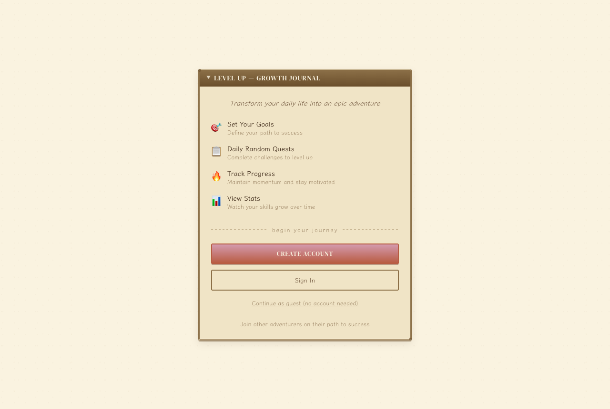
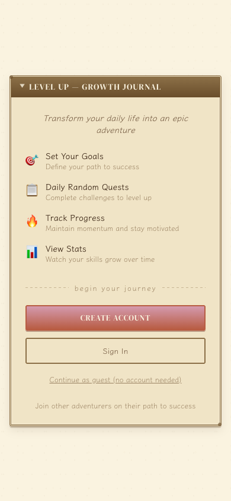
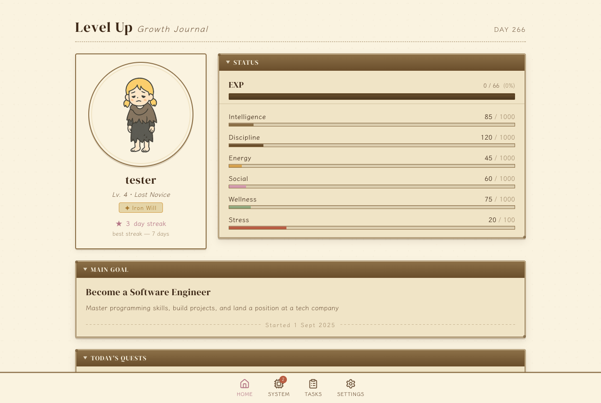
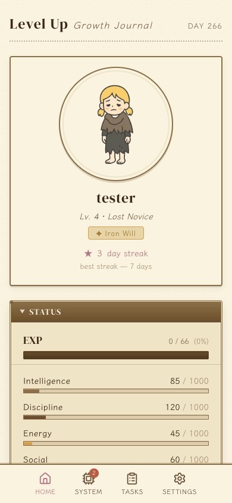
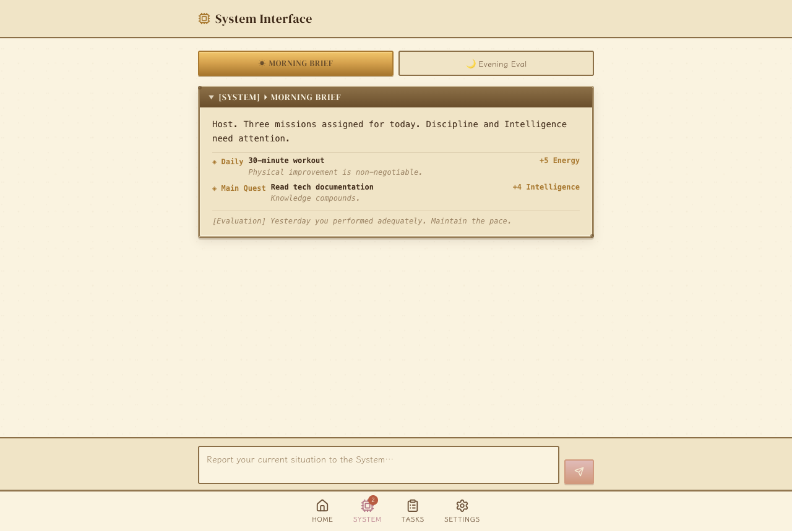
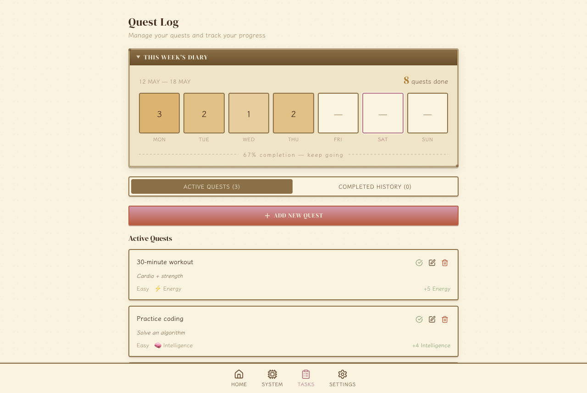

# LevelUp — Gamified Productivity App

> Reframe everyday productivity as an RPG-style journey. Complete real-world tasks, develop six core attributes, level up your character, and let the AI-powered System companion keep you accountable.

## Live Demo

**Try the app:** [https://levelup-jet.vercel.app/home](https://levelup-jet.vercel.app/home)

[](https://github.com/elena1211/gamified_app/actions/workflows/ci.yml)
[](https://www.djangoproject.com/)
[](https://reactjs.org/)
[](https://www.python.org/)
[](https://opensource.org/licenses/MIT)

---

## Screenshots

### Welcome page





---

### Home — character dashboard





*Two-column layout on desktop (portrait + STATUS window). Stacks to single column on mobile.*

---

### System — AI companion



*Morning Brief shows AI-generated missions. The chat input lets the host describe their current situation to receive tailored quests.*

---

### Quest Log — task management



*Weekly diary grid, active quests with attribute tags, and completed-history tab.*

---

## Table of Contents

- [Overview](#overview)
- [Features](#features)
- [Tech Stack](#tech-stack)
- [Installation](#installation)
- [Testing](#testing)
- [Environment Variables](#environment-variables)
- [API Reference](#api-reference)
- [Project Structure](#project-structure)
- [Deployment](#deployment)
- [Known Limitations](#known-limitations)

---

## Overview

LevelUp is a web application that turns daily task management into a character-raising game. Every real task the user completes increases one of six character attributes and earns experience points. Missing tasks reduces attributes and can trigger penalties. The progression loop includes both reward and risk, making progress feel authentic rather than a one-way point accumulation.

The app is built on a modular Django + React architecture and ships with:

- A retro RPG visual design system (parchment palette, double-line window frames, JRPG-style stat bars)
- An AI-powered **System companion** backed by the Anthropic Claude API, which generates contextual daily missions, evaluates evening performance, and applies stat penalties for inactivity
- Goal-aware task selection that biases daily quests toward attributes aligned with the user's chosen goal
- A first-run onboarding walkthrough and a guest mode that requires no registration

---

## Features

### Task Management

- **Daily Quests** — 3–6 tasks drawn per day, weighted toward the attributes that match the user's goal
- **Time-Limited Micro Quests** — short challenges with a countdown timer; a preview screen lets users read and accept before the timer starts
- **Task Creation** — users can add their own tasks with custom titles, descriptions, and attribute focus
- **Completion History** — full log of all completed activities

### Character Progression

| Attribute | Represents |
|---|---|
| Intelligence | Learning, coding, problem-solving |
| Discipline | Habits, consistency, self-control |
| Energy | Exercise, movement, vitality |
| Social | Communication, relationships |
| Wellness | Mental health, mindfulness |
| Stress | Managed separately — lower is better |

- Experience points and level system with exponential scaling
- Visual avatar that evolves across five milestone stages
- Earned titles (Iron Will, Consistent Scholar, Overachiever, etc.)
- Streak tracking with max-streak record

### System Companion (AI)

The System tab is a chat interface backed by the Anthropic Claude API:

- **Morning Brief** — generates 2–3 contextual missions for the day based on the user's goal, current stats, and recent completion rate
- **Evening Evaluation** — reviews today's performance and issues a bonus or penalty mission
- **Free Chat** — the user describes their current situation and the System generates relevant missions
- **Punishment Check** — on app open, if yesterday's completion rate was below 30 %, the System applies a stat debuff and creates a Redemption Quest
- **Personality Archetypes** — each user is randomly assigned a System personality (logical, mentor, tsundere, or drill sergeant) that shapes tone

### Onboarding and Accessibility

- 4-slide first-run tutorial that covers tasks, stats, time-limited quests, and the System companion
- Tutorial can be replayed from the Settings page
- Guest mode — one tap from the Welcome screen generates a local `guest_<id>` session with no registration required; Settings page prompts the guest to upgrade

### Visual Design

- Retro RPG aesthetic: parchment background (`#FAF3E0`), double-line window frames, warm ink typography
- Fonts: Klee One (body) + DM Serif Display (headings)
- RPG-style CSS utility classes: `.rpg-window`, `.rpg-header`, `.exp-bar`, `.stat-gauge`, `.task-diamond`, `.paper-divider`
- Responsive: two-column desktop layout (portrait + STATUS window) collapses to single column on mobile

---

## Tech Stack

### Frontend

| Technology | Version | Role |
|---|---|---|
| React | 19.1.0 | UI framework |
| Vite | 7.0 | Build tool and dev server |
| Tailwind CSS | 4.1 | Utility-first styling |
| React Router | 7.7 | Client-side routing |
| Lucide React | — | Icon library |

### Backend

| Technology | Version | Role |
|---|---|---|
| Django | 5.2.5 | Web framework |
| Django REST Framework | 3.x | API layer |
| PostgreSQL | — | Production database (Neon) |
| SQLite | — | Local development database |
| Anthropic Python SDK | ≥0.25.0 | Claude API integration |
| Gunicorn | — | Production WSGI server |
| WhiteNoise | — | Static file serving |

### Infrastructure

- **Backend hosting**: Render (free tier — wakes on first request after 15 min inactivity)
- **Frontend hosting**: Vercel
- **Database**: Neon (PostgreSQL)
- **API retry logic**: automatic backoff on 502/503/504 to handle Render cold starts

---

## Installation

### Prerequisites

- Python 3.13+
- Node.js 18+
- npm

### Backend Setup

```bash
# 1. Clone the repository
git clone https://github.com/elena1211/gamified_app.git
cd LevelUp_Project

# 2. Create and activate a virtual environment
python -m venv .venv
source .venv/bin/activate        # Windows: .venv\Scripts\activate

# 3. Install Python dependencies
pip install -r requirements.txt

# 4. Run migrations
python manage.py migrate

# 5. Start the development server
python manage.py runserver
```

### Frontend Setup

```bash
# 1. Navigate to the frontend directory
cd frontend

# 2. Install dependencies
npm install

# 3. Start the development server
npm run dev
```

The app will be available at `http://localhost:5173`.  
The Django API runs at `http://localhost:8000/api`.

---

## Testing

```bash
# Backend (Django test runner)
python manage.py test backend

# Frontend (Vitest + React Testing Library)
cd frontend
npm test
```

Both suites run automatically on every push and pull request via [GitHub Actions](.github/workflows/ci.yml).

---

## Environment Variables

### Frontend (`frontend/.env.development`)

```env
VITE_API_URL=http://127.0.0.1:8000/api
```

### Backend (`.env` or Render environment)

| Variable | Required | Description |
|---|---|---|
| `SECRET_KEY` | Yes | Django secret key |
| `DEBUG` | No | Set `False` in production |
| `DATABASE_URL` | Production | PostgreSQL connection string (Neon) |
| `ANTHROPIC_API_KEY` | Yes (System feature) | Claude API key — get one at [console.anthropic.com](https://console.anthropic.com) |
| `ALLOWED_HOSTS` | Production | Comma-separated list of allowed host names |

> **Note:** Without `ANTHROPIC_API_KEY`, the System companion tab will return an error. All other features work without it.

---

## API Reference

### Base URL

```
https://gamified-app-p9ao.onrender.com/api   # production
http://localhost:8000/api                     # local
```

All endpoints accept a `?user=<username>` query parameter. If the username does not exist it is created automatically.

### Authentication

| Method | Endpoint | Description |
|---|---|---|
| POST | `/register/` | Create a new account |
| POST | `/login/` | Sign in |

### Tasks

| Method | Endpoint | Description |
|---|---|---|
| GET | `/tasks/` | Retrieve today's daily tasks (goal-weighted) |
| POST | `/tasks/` | Create a new task |
| GET | `/tasks/<id>/` | Get a single task |
| POST | `/tasks/complete/` | Toggle task completion |
| POST | `/tasks/complete-dynamic/` | Complete a time-limited quest |
| POST | `/tasks/uncomplete-dynamic/` | Undo a time-limited quest |
| GET | `/tasks/completed-history/` | Full completion history |
| GET | `/tasks/weekly-stats/` | 7-day completion breakdown |

### User

| Method | Endpoint | Description |
|---|---|---|
| GET | `/user/stats/` | Level, EXP, streak, attributes, join date |
| GET | `/user/progress/` | Completion rate and task counts |

### Goals

| Method | Endpoint | Description |
|---|---|---|
| GET | `/goal/` | Retrieve the user's current goal |
| POST | `/goal/` | Create or update the goal |

### System (AI)

| Method | Endpoint | Description |
|---|---|---|
| POST | `/system/chat/` | Generate missions via Claude API |
| GET | `/system/messages/` | Last 10 system log entries |
| GET | `/system/daily-status/` | Unread count, active title, morning-brief flag |
| POST | `/system/punishment-check/` | Apply daily penalty if yesterday's rate < 30 % |

#### `/system/chat/` request body

```json
{
  "user": "elena",
  "message": "I have a job interview tomorrow",
  "context_type": "user_input"
}
```

`context_type` values: `morning_brief` | `evening_eval` | `user_input`

---

## Project Structure

```
LevelUp_Project/
├── backend/
│   ├── models.py          # User, Task, Goal, UserAttribute,
│   │                      # UserTaskLog, SystemLog, UserTitle
│   ├── views.py           # All API views
│   ├── urls.py            # Root URL conf
│   ├── urls_api.py        # /api/* routes
│   ├── settings.py        # Django settings (dev + prod)
│   └── migrations/
├── frontend/
│   ├── src/
│   │   ├── components/
│   │   │   ├── BottomNav.jsx           # 4-tab navigation with System unread badge
│   │   │   ├── OnboardingTutorial.jsx  # 4-slide first-run walkthrough
│   │   │   ├── StatsPanel.jsx          # RPG attribute table with gauges
│   │   │   ├── SystemAlert.jsx         # Floating unread-message nudge
│   │   │   ├── SystemMessageBox.jsx    # Typewriter AI message display
│   │   │   ├── TaskList.jsx            # Diamond-checkbox task list
│   │   │   ├── TimeLimitedTaskPopup.jsx # Preview → countdown quest flow
│   │   │   ├── UserProfileCard.jsx     # Portrait, level, streak, title
│   │   │   ├── WeeklyTaskStats.jsx     # 7-day diary grid
│   │   │   └── ...                     # Modal, LevelUpModal, RewardPopup, etc.
│   │   ├── pages/
│   │   │   ├── HomePage.jsx            # Main dashboard (2-col RPG layout)
│   │   │   ├── SystemPage.jsx          # AI System companion chat
│   │   │   ├── TaskManagerPage.jsx     # Task CRUD
│   │   │   ├── SystemSettingsPage.jsx  # Account and preferences
│   │   │   ├── WelcomePage.jsx         # Login + guest mode
│   │   │   └── RegisterPage.jsx        # 2-step registration
│   │   ├── context/
│   │   │   └── AppContext.jsx          # Global state (stats, system, auth)
│   │   ├── config/
│   │   │   └── api.js                  # API endpoints + cold-start retry logic
│   │   └── utils/
│   │       ├── avatar.js               # Level → stage/title/EXP helpers
│   │       └── taskUtils.js            # Title cleaning utilities
│   ├── index.html
│   └── index.css                       # Design tokens + RPG utility classes
├── requirements.txt
├── manage.py
└── README.md
```

---

## Deployment

### Render (backend)

1. Connect the GitHub repository to a new Render Web Service.
2. Set the build command: `pip install -r requirements.txt`
3. Set the start command: `gunicorn backend.wsgi --workers 2`
4. Add environment variables: `SECRET_KEY`, `DATABASE_URL`, `ANTHROPIC_API_KEY`, `ALLOWED_HOSTS`.
5. After the first deploy, open the Render Shell and run:

   ```bash
   python manage.py migrate
   python manage.py createcachetable   # backs the API rate limiting
   ```

### Vercel (frontend)

1. Connect the GitHub repository to a new Vercel project.
2. Set the root directory to `frontend`.
3. Add the environment variable `VITE_API_URL=https://gamified-app-p9ao.onrender.com/api`.
4. Deploy.

---

## Known Limitations

- The Render free tier sleeps after 15 minutes of inactivity; the first request after sleep can take 30–60 seconds. The app retries automatically with exponential backoff.
- The System companion requires a valid `ANTHROPIC_API_KEY`. Without one, the System tab will surface an error message.
- User authentication uses session-based login without OAuth; not recommended for sensitive data.
- Automated tests cover core models and API views (backend) and key components (frontend) — see [Testing](#testing). Coverage is not exhaustive.

---

## License

MIT — see [LICENSE](LICENSE) for details.
