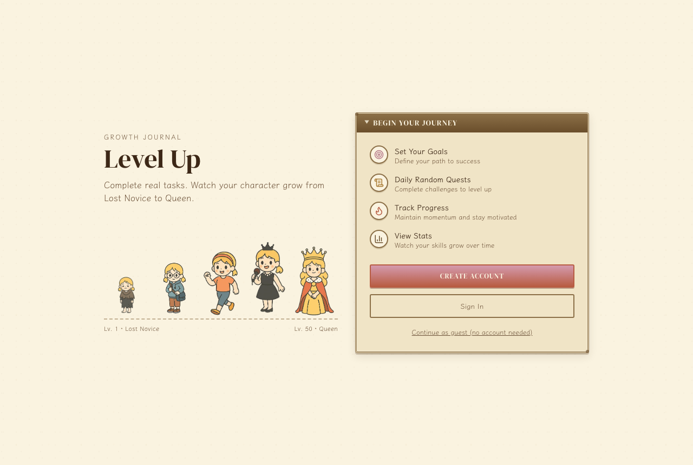
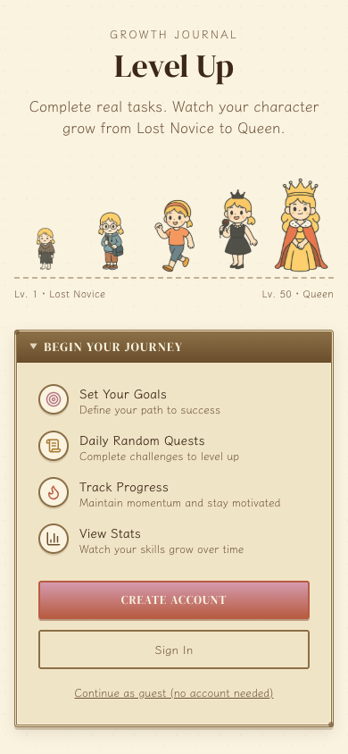
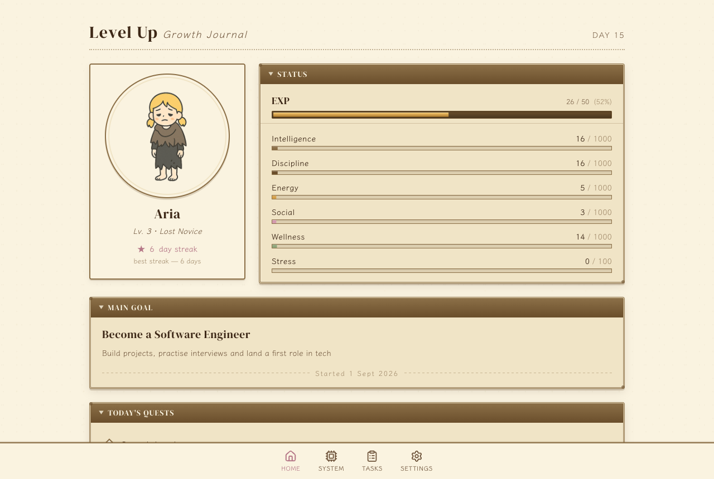
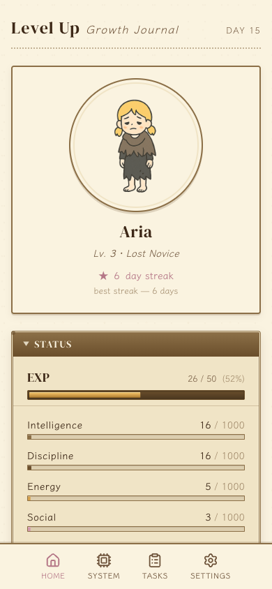
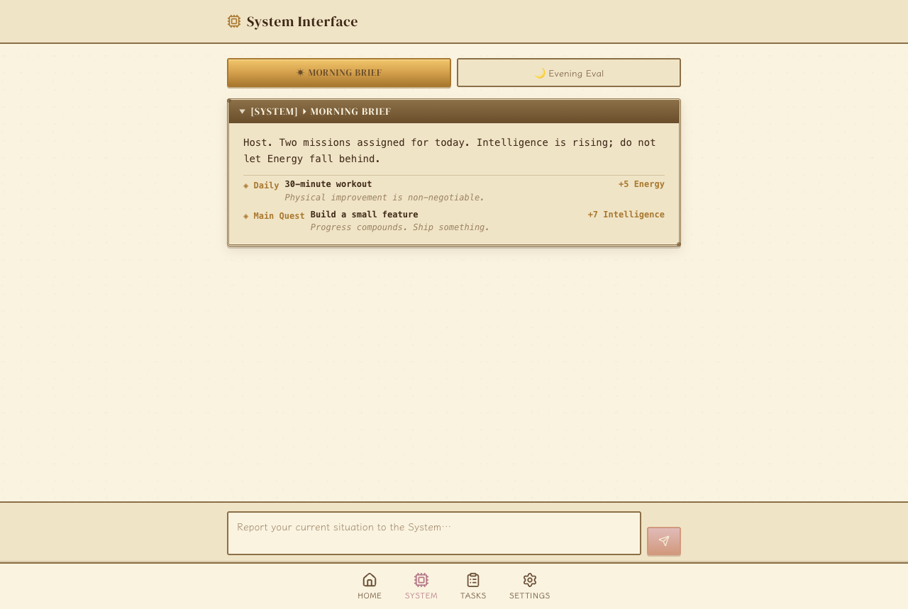
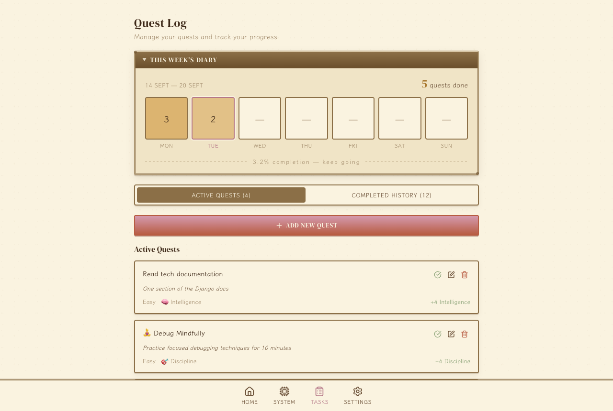

# LevelUp — Gamified Productivity App

> Reframe everyday productivity as an RPG-style journey. Complete real-world tasks, develop six core attributes, level up your character, and let the AI-powered System companion keep you accountable.

## Live Demo

**Try the app:** [https://levelup-jet.vercel.app/home](https://levelup-jet.vercel.app/home)

[](https://github.com/elena1211/gamified_app/actions/workflows/ci.yml)
[](https://www.djangoproject.com/)
[](https://reactjs.org/)
[](https://www.python.org/)
[](https://opensource.org/licenses/MIT)

---

## Origin

LevelUp began as my MSc dissertation at Queen Mary University of London —
*Adaptive, Gamified Task-Scheduling for Sustainable Personal Growth* — and is now
maintained as an ongoing project.

The design draws on **Self-Determination Theory** (Deci & Ryan), which holds that
motivation depends on satisfying the needs for autonomy, competence and
relatedness. LevelUp targets competence: progress is only motivating if the user
can see it, so feedback has to be immediate, meaningful and visible. That is why
the stat gains, EXP bars, level-ups and attribute growth are not decoration — they
are the thesis made tangible. It is also why the reward loop carries real risk:
missed tasks cost attribute points, because feedback that only ever rewards stops
being information.

Development since the dissertation has focused on the parts academic prototypes
usually skip: authentication, input validation, server-authoritative game state,
and an automated test suite.

---

## Screenshots

### Welcome page





---

### Home — character dashboard





*Two-column layout on desktop (portrait + STATUS window). Stacks to single column on mobile.*

---

### System — AI companion



*Morning Brief shows AI-generated missions. The chat input lets the host describe their current situation to receive tailored quests.*

---

### Quest Log — task management



*Weekly diary grid, active quests with attribute tags, and completed-history tab.*

---

## Table of Contents

- [Overview](#overview)
- [Features](#features)
- [Tech Stack](#tech-stack)
- [Installation](#installation)
- [Testing](#testing)
- [Environment Variables](#environment-variables)
- [API Reference](#api-reference)
- [Project Structure](#project-structure)
- [Deployment](#deployment)
- [Project History](#project-history)
- [Known Limitations](#known-limitations)

---

## Overview

LevelUp is a web application that turns daily task management into a character-raising game. Every real task the user completes increases one of six character attributes and earns experience points. Missing tasks reduces attributes and can trigger penalties. The progression loop includes both reward and risk, making progress feel authentic rather than a one-way point accumulation.

The app is built on a modular Django + React architecture and ships with:

- A retro RPG visual design system (parchment palette, double-line window frames, JRPG-style stat bars)
- An AI-powered **System companion** backed by a pluggable AI provider (NVIDIA NIM by default, Anthropic Claude optional), which generates contextual daily missions, evaluates evening performance, and applies stat penalties for inactivity
- Goal-aware task selection that biases daily quests toward attributes aligned with the user's chosen goal
- A first-run onboarding walkthrough and a guest mode that requires no registration

---

## Features

### Task Management

- **Daily Quests** — 3–6 tasks drawn per day, weighted toward the attributes that match the user's goal
- **Time-Limited Micro Quests** — short challenges with a countdown timer; a preview screen lets users read and accept before the timer starts
- **Task Creation** — users can add their own tasks with custom titles, descriptions, and attribute focus
- **Completion History** — full log of all completed activities

### Character Progression

| Attribute | Represents |
|---|---|
| Intelligence | Learning, coding, problem-solving |
| Discipline | Habits, consistency, self-control |
| Energy | Exercise, movement, vitality |
| Social | Communication, relationships |
| Wellness | Mental health, mindfulness |
| Stress | Managed separately — lower is better |

- Experience points and level system with exponential scaling
- Visual avatar that evolves across five milestone stages
- Earned titles (Iron Will, Consistent Scholar, Overachiever, etc.)
- Streak tracking with max-streak record

### System Companion (AI)

The System tab is a chat interface backed by a pluggable AI provider — NVIDIA NIM by
default (free, rate-limited), with Anthropic Claude available via `AI_PROVIDER=anthropic`:

- **Morning Brief** — generates 2–3 contextual missions for the day based on the user's goal, current stats, and recent completion rate
- **Evening Evaluation** — reviews today's performance and issues a bonus or penalty mission
- **Free Chat** — the user describes their current situation and the System generates relevant missions
- **Punishment Check** — on app open, if yesterday's completion rate was below 30 %, the System applies a stat debuff and creates a Redemption Quest
- **Personality Archetypes** — each user is randomly assigned a System personality (logical, mentor, tsundere, or drill sergeant) that shapes tone

### Onboarding and Accessibility

- 4-slide first-run tutorial that covers tasks, stats, time-limited quests, and the System companion
- Tutorial can be replayed from the Settings page
- Guest mode — one tap from the Welcome screen generates a local `guest_<id>` session with no registration required; Settings page prompts the guest to upgrade

### Visual Design

- Retro RPG aesthetic: parchment background (`#FAF3E0`), double-line window frames, warm ink typography
- Fonts: Klee One (body) + DM Serif Display (headings)
- RPG-style CSS utility classes: `.rpg-window`, `.rpg-header`, `.exp-bar`, `.stat-gauge`, `.task-diamond`, `.paper-divider`
- Responsive: two-column desktop layout (portrait + STATUS window) collapses to single column on mobile

---

## Tech Stack

### Frontend

| Technology | Version | Role |
|---|---|---|
| React | 19.1.0 | UI framework |
| Vite | 7.0 | Build tool and dev server |
| Tailwind CSS | 4.1 | Utility-first styling |
| React Router | 7.7 | Client-side routing |
| Lucide React | — | Icon library |

### Backend

| Technology | Version | Role |
|---|---|---|
| Django | 5.2.5 | Web framework |
| Django REST Framework | 3.x | API layer |
| PostgreSQL | — | Production database (Neon) |
| SQLite | — | Local development database |
| OpenAI Python SDK | ≥1.0.0 | System companion — default provider (NVIDIA NIM, OpenAI-compatible) |
| Anthropic Python SDK | ≥0.25.0 | System companion — optional provider (`AI_PROVIDER=anthropic`) |
| Gunicorn | — | Production WSGI server |
| WhiteNoise | — | Static file serving |

### Infrastructure

- **Backend hosting**: Render (free tier — wakes on first request after 15 min inactivity)
- **Frontend hosting**: Vercel
- **Database**: Neon (PostgreSQL)
- **API retry logic**: automatic backoff on 502/503/504 to handle Render cold starts

---

## Installation

### Prerequisites

- Python 3.13+
- Node.js 20.19+
- npm

### Backend Setup

```bash
# 1. Clone the repository
git clone https://github.com/elena1211/gamified_app.git
cd gamified_app

# 2. Create and activate a virtual environment
python3 -m venv .venv            # Windows: python -m venv .venv
source .venv/bin/activate        # Windows: .venv\Scripts\activate

# 3. Install Python dependencies
pip install -r requirements.txt

# 4. Create the environment file
#    The defaults work as-is: DEBUG on, a dev SECRET_KEY, and local SQLite.
cp .env.example .env

# 5. Run migrations
python manage.py migrate

# 6. Create the cache table used by rate limiting
#    Without this, registering or starting a guest session fails.
python manage.py createcachetable   # prints nothing on success

# 7. Start the development server
python manage.py runserver       # http://localhost:8000
```

### Frontend Setup

```bash
# 1. Navigate to the frontend directory
cd frontend

# 2. Install dependencies
npm install

# 3. Start the development server
npm run dev
```

The app will be available at `http://localhost:5173`.  
The Django API runs at `http://localhost:8000/api`.

---

## Testing

```bash
# Backend (Django test runner)
python manage.py test backend

# Frontend (Vitest + React Testing Library)
cd frontend
npm test
```

Both suites run automatically on pushes to `main` and on pull requests targeting `main`, via [GitHub Actions](.github/workflows/ci.yml).

---

## Environment Variables

### Frontend (`frontend/.env.development`)

```env
VITE_API_URL=http://127.0.0.1:8000/api
```

### Backend (`.env` or Render environment)

| Variable | Required | Description |
|---|---|---|
| `SECRET_KEY` | Yes | Django secret key |
| `DEBUG` | No | `1` enables debug mode; anything else disables it. Leave unset in production |
| `DATABASE_URL` | Yes | Database connection string — SQLite locally, PostgreSQL (Neon) in production |
| `AI_PROVIDER` | No | `nvidia` (default) or `anthropic` — selects the System companion's AI backend |
| `NVIDIA_API_KEY` | Yes, if using the default `nvidia` provider | Free API key from [build.nvidia.com](https://build.nvidia.com) |
| `NVIDIA_MODEL` | No | NVIDIA NIM model slug (default: `meta/llama-3.1-70b-instruct`) |
| `ANTHROPIC_API_KEY` | Yes, if `AI_PROVIDER=anthropic` | Claude API key — get one at [console.anthropic.com](https://console.anthropic.com) |
| `ALLOWED_HOSTS` | No | Comma-separated host names. Left unset, production falls back to the Render hosts |
| `ADMIN_URL` | No | Path for the Django admin (default `admin`) |

> **Note:** Without a configured AI provider key, the System companion tab will return an error. All other features work without it. The default `nvidia` provider is free (rate-limited); `anthropic` is billed per request but generally gives higher-quality output.

---

## API Reference

### Base URL

```
https://gamified-app-p9ao.onrender.com/api   # production
http://localhost:8000/api                     # local
```

Every endpoint requires a token except `/register/`, `/login/` and `/guest/`. (The
deployment health probe lives outside the API, at `/health/` on the site root.)
Obtain a token from `/register/`, `/login/` or `/guest/`, then send it on each
request:

```
Authorization: Token <token>
```

Requests identify the caller from that token alone — there is no user parameter, and
every object lookup is scoped to the authenticated owner.

### Authentication

| Method | Endpoint | Description |
|---|---|---|
| POST | `/register/` | Create a new account |
| POST | `/login/` | Sign in |
| POST | `/guest/` | Start a guest session (no password) |
| POST | `/upgrade-guest/` | Convert the current guest into a real account, keeping all progress |

### Tasks

| Method | Endpoint | Description |
|---|---|---|
| GET | `/tasks/` | Retrieve today's daily tasks (goal-weighted) |
| POST | `/tasks/` | Create a new task |
| GET | `/tasks/<id>/` | Get a single task |
| PUT | `/tasks/<id>/` | Edit a task |
| DELETE | `/tasks/<id>/` | Delete a task |
| POST | `/tasks/complete/` | Toggle task completion |
| POST | `/tasks/complete-dynamic/` | Complete a daily task or time-limited quest |
| POST | `/tasks/uncomplete-dynamic/` | Undo a daily task completion |
| GET | `/tasks/completed-history/` | Full completion history |
| GET | `/tasks/weekly-stats/` | 7-day completion breakdown |

### User

| Method | Endpoint | Description |
|---|---|---|
| GET | `/user/stats/` | Level, EXP, streak, attributes, join date |
| GET | `/user/progress/` | Completion rate and task counts |

### Goals

| Method | Endpoint | Description |
|---|---|---|
| GET | `/goal/` | Retrieve the user's current goal |

> The goal is set during registration. Editing it after sign-up is not yet supported —
> see [Known Limitations](#known-limitations).

### System (AI)

| Method | Endpoint | Description |
|---|---|---|
| POST | `/system/chat/` | Generate missions via the configured AI provider |
| GET | `/system/messages/` | Last 10 system log entries |
| GET | `/system/daily-status/` | Unread count, active title, morning-brief flag |
| POST | `/system/punishment-check/` | Apply daily penalty if yesterday's rate < 30 % |

#### `/system/chat/` request body

```json
{
  "message": "I have a job interview tomorrow",
  "context_type": "user_input"
}
```

`context_type` values: `morning_brief` | `evening_eval` | `user_input`

---

## Project Structure

```
gamified_app/
├── backend/
│   ├── models.py          # User, Task, Goal, UserAttribute,
│   │                      # UserTaskLog, SystemLog, UserTitle
│   ├── views.py           # All API views
│   ├── urls.py            # Root URL conf
│   ├── urls_api.py        # /api/* routes
│   ├── settings.py        # Django settings (dev + prod)
│   └── migrations/
├── frontend/
│   ├── src/
│   │   ├── components/
│   │   │   ├── BottomNav.jsx           # 4-tab navigation with System unread badge
│   │   │   ├── OnboardingTutorial.jsx  # 4-slide first-run walkthrough
│   │   │   ├── StatsPanel.jsx          # RPG attribute table with gauges
│   │   │   ├── SystemAlert.jsx         # Floating unread-message nudge
│   │   │   ├── SystemMessageBox.jsx    # Typewriter AI message display
│   │   │   ├── TaskList.jsx            # Diamond-checkbox task list
│   │   │   ├── TimeLimitedTaskPopup.jsx # Preview → countdown quest flow
│   │   │   ├── UserProfileCard.jsx     # Portrait, level, streak, title
│   │   │   ├── WeeklyTaskStats.jsx     # 7-day diary grid
│   │   │   └── ...                     # Modal, LevelUpModal, RewardPopup, etc.
│   │   ├── pages/
│   │   │   ├── HomePage.jsx            # Main dashboard (2-col RPG layout)
│   │   │   ├── SystemPage.jsx          # AI System companion chat
│   │   │   ├── TaskManagerPage.jsx     # Task CRUD
│   │   │   ├── SystemSettingsPage.jsx  # Account and preferences
│   │   │   ├── WelcomePage.jsx         # Login + guest mode
│   │   │   └── RegisterPage.jsx        # 2-step registration
│   │   ├── context/
│   │   │   └── AppContext.jsx          # Global state (stats, system, auth)
│   │   ├── config/
│   │   │   └── api.js                  # API endpoints + cold-start retry logic
│   │   ├── utils/
│   │   │   ├── avatar.js               # Level → stage/title/EXP helpers
│   │   │   ├── logger.js               # debugLog — dev-only console output
│   │   │   └── taskUtils.js            # Title cleaning utilities
│   │   └── index.css                   # Design tokens + RPG utility classes
│   └── index.html
├── requirements.txt
├── manage.py
└── README.md
```

---

## Deployment

### Render (backend)

1. Connect the GitHub repository to a new Render Web Service.
2. Set the build command: `pip install -r requirements.txt`
3. Leave the start command blank so Render uses the `Procfile` (it runs `migrate` and `createcachetable` before gunicorn)
4. Add environment variables: `SECRET_KEY`, `DATABASE_URL`, `NVIDIA_API_KEY` (or `AI_PROVIDER=anthropic` + `ANTHROPIC_API_KEY`), `ALLOWED_HOSTS`.
5. After the first deploy, open the Render Shell and run:

   ```bash
   python manage.py migrate
   python manage.py createcachetable   # backs the API rate limiting
   ```

### Vercel (frontend)

1. Connect the GitHub repository to a new Vercel project.
2. Set the root directory to `frontend`.
3. Add the environment variable `VITE_API_URL=https://gamified-app-p9ao.onrender.com/api`.
4. Deploy.

---

## Project History

This repository's history covers the dissertation build (mid-2025), a Railway
deployment that never stabilised, the migration to Render + Vercel + Neon in early
2026, and the hardening work since.

The early commits are messy. August 2025 was the heaviest month — most of the feature
work landed then, alongside roughly forty commits of deployment debugging: repeated
attempts at build commands, static files and start-up configuration against a platform
I did not yet understand. Rather than keep patching it, I moved the stack to Render
with a managed Neon database, which is what the app runs on today.

Commits from 2026 onward follow a consistent convention, and each one is a single
reviewed change with its reasoning in the message body.

---

## Known Limitations

- The Render free tier sleeps after 15 minutes of inactivity; the first request after sleep can take 30–60 seconds. The app retries automatically with exponential backoff.
- The System companion requires a configured AI provider key (`NVIDIA_API_KEY` by default, or `ANTHROPIC_API_KEY` if `AI_PROVIDER=anthropic`). Without one, the System tab will surface an error message.
- NVIDIA's free NIM API (the default provider) is rate-limited (~40 requests/minute) and positioned by NVIDIA for prototyping rather than guaranteed production traffic.
- Authentication uses DRF tokens, which do not expire and cannot yet be revoked server-side (there is no logout endpoint). Rotating refresh tokens are the intended next step; there is no OAuth or social login.
- Guest session IDs are generated client-side and act as the only credential for that account, so a guessed ID grants access to it. Guest accounts are intended for trying the demo, not for real data.
- The goal is set at registration and cannot be edited afterwards.
- Day boundaries use a single timezone (`Europe/London`) rather than each user's own, so streaks and the daily reset roll over at UK midnight regardless of where the user is. Per-user timezones are the next step.
- There is no password reset, and account deletion and data export are not yet implemented — both are prerequisites for opening the app to real users.
- Automated tests cover core models and API views (backend) and key components (frontend) — see [Testing](#testing). Coverage is not exhaustive.

---

## License

MIT — see [LICENSE](LICENSE) for details.
